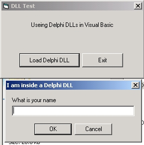



## Call Delphi DLL in VB

### Description

Hi this small example will show you how to call a delphi dll in your applications. it's ps you will need to compile the dll in Delphi for this example to work. Iam sure you all have delphi somewere. See ya.
 
### More Info
 

             |
---                |---
**Submitted On**   |2002-05-04 14:34:50
**By**             |[dreamvb](https://github.com/Planet-Source-Code/PSCIndex/blob/master/ByAuthor/dreamvb.md)
**Level**          |Beginner
**User Rating**    |5.0 (20 globes from 4 users)
**Compatibility**  |VB 6\.0
**Category**       |[Libraries](https://github.com/Planet-Source-Code/PSCIndex/blob/master/ByCategory/libraries__1-49.md)
**World**          |[Visual Basic](https://github.com/Planet-Source-Code/PSCIndex/blob/master/ByWorld/visual-basic.md)
**Archive File**   |[Call Delph203365312001\.zip](https://github.com/Planet-Source-Code/dreamvb-call-delphi-dll-in-vb__1-23628/archive/master.zip)

